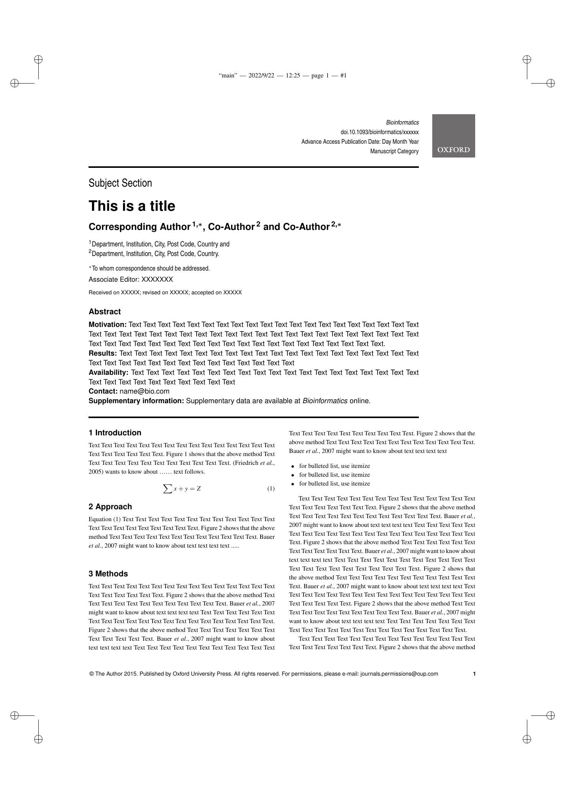
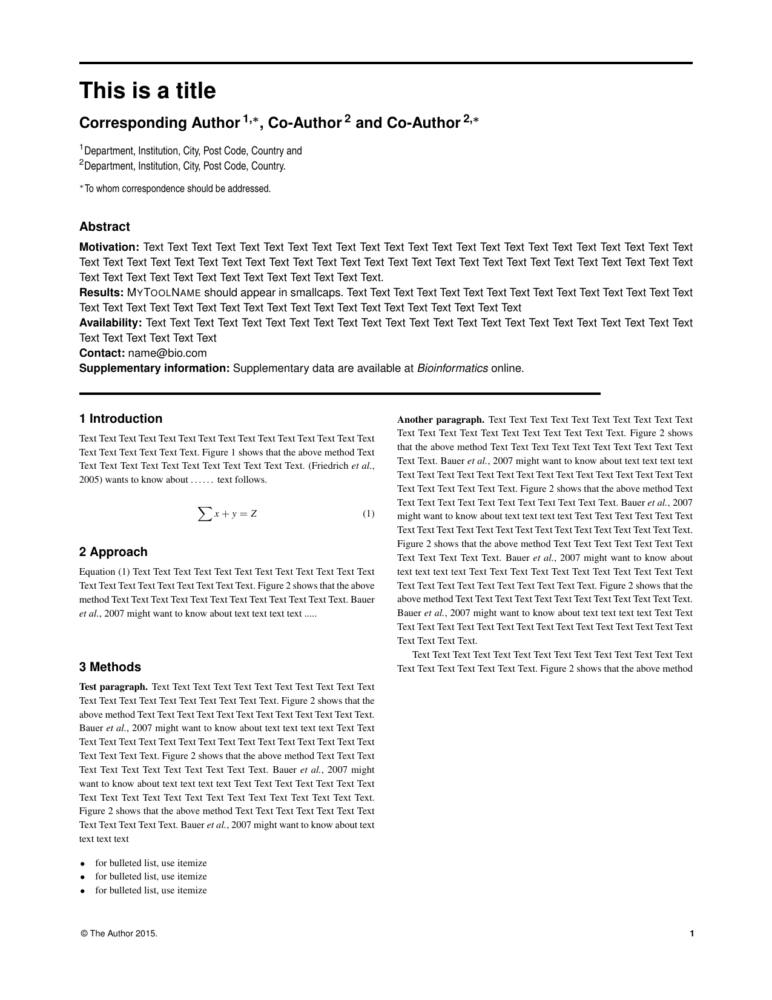

* Jan 2026: A new template, again

They updated the [[https://www.overleaf.com/latex/templates/oup-general-template/fqkhysbcbpwv][Overleaf template]] again, as linked from the [[https://academic.oup.com/pages/for-authors/journals/preparing-and-submitting-your-manuscript][OUP page]].
They promise a 'direct download' link, but it's broken, so to again save you the
effort of cloning an Overleaf repo, [[file:OUP_General_Template_4.zip][here]] is the latest zip, =OUP_General_Template_4.zip=.

As before and as mentioned in the sheet [[https://academic.oup.com/pages/authoring/journals/preparing_your_manuscript#latex][linked on this page]], for Bioinformatics
you'll have to change the documentclass to
#+begin_src latex
\documentclass[numsec,webpdf,modern,large]
#+end_src
add change the citation style:
#+begin_src latex
\bibliographystyle{author-date}
#+end_src
(instead of =abbrvnat= in previous versions).
It's still weird though, because there is a comment stating
#+begin_src latex
%UNCOMMENT THE BELOW TWO LINES IN CASE YOU NEED AUTHOR YEAR FORMAT.
%\bibliographystyle{oup-abbrvnat}
%\bibliography{reference}
#+end_src
and indeed a file =oup-abbrvnat.bst= is provided, and it seems to give the
same result as putting =author-date= directly...

* September 2024: Note on new template
+Currently+, Bioinformatics [[https://academic.oup.com/bioinformatics/pages/instructions_for_authors][recommends]]
[[https://www.overleaf.com/latex/templates/oup-general-template/ybpypwncdxyb][this new general template]] (meanwhile updated for 2026 version). Unfortunately it has very different styling from the
final/classic layout below, but I had to switch out my original template to the
general one on submission, so best to use that one by default now.

For convenience, a zip of the new template is [[./OUP General Template.zip][here]], so that cloning the Overleaf
template isn't needed.

For Bioinformatics, the sheet [[https://academic.oup.com/pages/authoring/journals/preparing_your_manuscript#latex][linked on this page]] indicates that the following
documentclass invocation should be used:
#+begin_src latex
\documentclass[numsec,webpdf,modern,large]
#+end_src
Also, add the following line:
#+begin_src latex
\bibliographystyle{abbrvnat}
#+end_src

* September 2022: Original readme

This repository contains a cleaned up latex template for Oxford Bioinformatics
that can be used for preprints.

The starting point (initial commit) is the version on Overleaf [[https://www.overleaf.com/latex/templates/template-for-oxford-bioinformatics-journal-new-version/zjrmbrmtrytg][here]] (meanwhile
updated to the Feb 2026 version).
See the git history or remarks below for a list of changes.

** WARNING
It seems that the overleaf package I based this on has changed meanwhile. I
copied things from there in September 2022 (see the initial commit here), but
the 'last modified date' on Overleaf is listed as April 2022. Very confusing.

Either way, it does seem that newly published papers look more like the current
version of the overleaf template rather than the one used here. But they are
still not identical. It's very confusing.

** Usage
Clone this repository or [[https://github.com/RagnarGrootKoerkamp/oxford-bioinformatics-template/archive/refs/heads/master.zip][download it as zip]] and run ~make~ from the repository root to start ~latexmk~
in /preview-continuously mode/.

** Changes

| Original             | Revised             |
|  |  |

*** Class and main file
- Remove OUP from front page footer, and add copyright symbol for even first pages.
- Remove Bioinformatics and image from front page header, remove ~\access~ and ~\appnotes~.
- Remove crop markers and change physical page size to ~11truein~ by
  ~8.5truein~.
- Change abstract and top rule to be the full page width.

  *NOTE*: Published papers are inconsistent here. Compare the
  [[https://doi.org/10.1093/bioinformatics/btaa777][WFA paper]] with the [[https://doi.org/10.1093/bioinformatics/btw753][Edlib paper]].
- Empty ~\subsection{}~, ~\history{}~, and ~\access{}~.
- Add ~T1~ font encoding to ~fontenc~ package for smallcaps support. NOTE: This changes the size of ~em~.
- Fix a typo in the sans-serif font used in captions. This changes captions from
  serif to sans-serif, and fixes italics and smallcaps inside captions. See [[https://tex.stackexchange.com/questions/453542/unable-to-use-texit-in-caption][tex.stackexchange]].

  *NOTE*: Some published Bioinformatics papers seem to still have the wrong serif captions.
- Redefine ~\paragraph{title}~ to print the paragraph title in bold, followed by
  a period.

*** File structure
- Move text from ~main.tex~ into ~paper/*.tex~.
- Add a bunch of default packages to [[paper/header.tex][paper/header.tex]], including ~hyperref~ for
  clickable links.
- Rename ~document.bib~ to ~bibliography.bib~, and remove unused ~plain.bst~.
- Add appendix.
